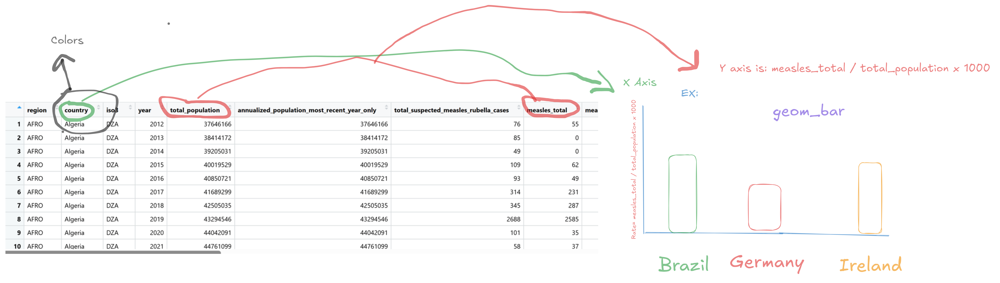
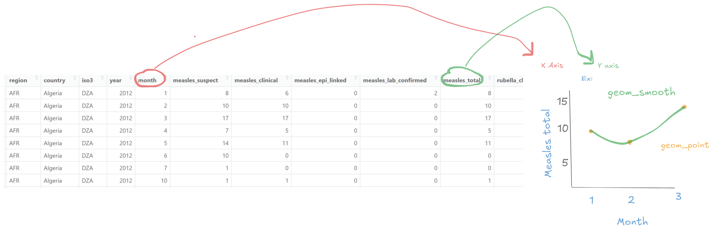

# Measles Data Set

## Context
The Data we are analyzing global provisional measles and rubella data that was downloaded from the World Health Organisation on June 12th, 2025. There are two different csvs that we can analyse, one being monthly cases while the other is yearly cases.

## Cleaning

The cases month data set is cleaned by making column names standardized with underscores. It is also cleaned by making every column from year to discarded numeric data. 

The cases year data set is cleaned by first making the first row values the column names. Then the column names are standardized with underscores. The columns are then all renamed to their desired names, and the first row of the data was removed.

## Research Questions for this data

1. Which country had the highest measles case rate per thousand population in the most recent year of data?

2. Which month typically has the most measles cases?

## Research Questions for supplemental data
1. Which regions have a higher vaccination rate, and does this lead to fewer measles cases per thousand in population?

2. Is there a relationship between a nations GDP per capita and measles cases?

## Drawing for question 1
```{r}
#| echo: false

```

## Drawing for question 2
```{r}
#| echo: false

```

